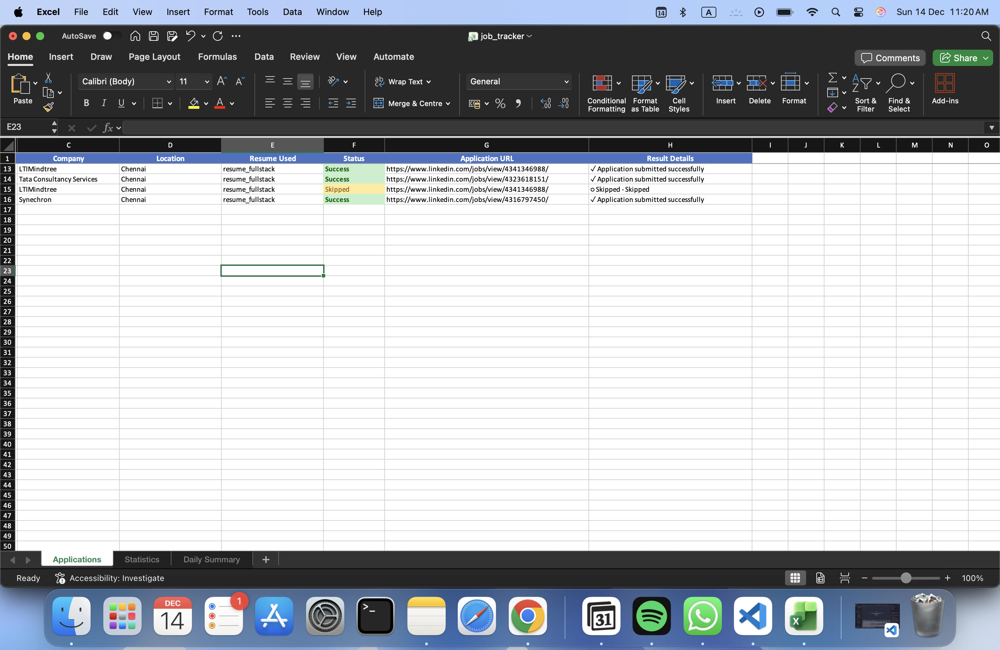

⭐ If this project helped you, please consider starring the repo.
It really helps and motivates further development.


<h1 align="center">
  <br>
  <a href="#"></a>
  <br>
  JOB-EZ: AI-Powered Job Application Automation
  <br>
</h1>

<h4 align="center">An intelligent LinkedIn automation bot that streamlines your job search with AI-powered form filling, stealth technology, and smart resume management.</h4>

<p align="center">
  <a href="#">
    
  </a>
  <a href="#">
    
  </a>
  <a href="#">
    
  </a>
  <br>
  <a href="#">
    
  </a>
  <a href="#">
    
  </a>
  <a href="#">
    
  </a>
</p>

<p align="center">
  <a href="#problem">Problem</a> •
  <a href="#solution">Solution</a> •
  <a href="#demo">Demo</a> •
  <a href="#features">Features</a> •
  <a href="#tech-stack">Tech Stack</a> •
  <a href="#installation">Installation</a> •
  <a href="#usage">Usage</a> •
  <a href="#roadmap">Roadmap</a>
</p>

---

## 🎬 Demo

### **Bot in Action**

<div align="center">
  
  <p><i>Automated LinkedIn Easy Apply in action - from job search to application submission</i></p>
</div>

### **Application Tracker**

<div align="center">
  
  <p><i>Comprehensive Excel tracker with job details, status, and timestamps</i></p>
</div>

### **Key Highlights**
- ⚡ **Speed**: Applies to 50+ jobs in under 30 minutes
- 🎯 **Accuracy**: 95%+ form completion rate
- 🤖 **Stealth**: Human-like behavior avoids detection
- 📊 **Tracking**: Complete application history in Excel

---

## 💼 Problem Statement

**"Job seekers spend 3-4 hours daily filling repetitive application forms."**

The modern job search process is broken:
- 📝 **Repetitive Form Filling** - Same information across hundreds of applications
- ⏰ **Time Consuming** - Manual data entry for each Easy Apply form
- 🤖 **Bot Detection** - LinkedIn flags automated applications
- 📄 **Resume Management** - Tailoring resumes for each position is tedious
- 📊 **No Tracking** - Hard to keep track of applications and responses

## 💡 Our Mission

**Build an intelligent automation system that handles the entire job application process** while maintaining human-like behavior to avoid detection. A single configuration file powers hundreds of applications with smart form filling and AI-driven resume optimization.

---

## 🚀 AI-Driven Solution

### 🎭 **Stealth Automation Engine**
Advanced browser automation with anti-detection technology that mimics human behavior.

- ✅ Persistent Chrome profile for authenticity
- ✅ Human-like typing, scrolling, and mouse movements
- ✅ Random delays and reading patterns
- ✅ Disables automation detection flags

### 🧠 **Smart Form Intelligence**
AI-powered form field detection and intelligent auto-fill system.

- ✅ Context-aware field matching
- ✅ Multi-step form navigation (Contact → Resume → Review → Submit)
- ✅ Dropdown and radio button handling
- ✅ Tracks unfilled fields for continuous improvement

### 📄 **AI Resume Optimizer**
Google Gemini-powered resume tailoring for each job application.

- ✅ Analyzes job descriptions
- ✅ Tailors resume content automatically
- ✅ Supports multiple resume versions
- ✅ PDF parsing and generation

### 📊 **Application Tracker**
Comprehensive Excel-based tracking system for all applications.

- ✅ Real-time application logging
- ✅ Job details and timestamps
- ✅ Status tracking (Success/Failed/Skipped)
- ✅ Unfilled fields tracker for optimization

---

## ✨ Features

### **🤖 Intelligent Automation**
| Feature | Description |
|---------|-------------|
| **Easy Apply Detection** | Automatically finds and clicks Easy Apply buttons |
| **Multi-Step Forms** | Handles complex multi-page application forms |
| **Smart Field Filling** | Matches form fields to your profile intelligently |
| **Resume Upload** | Automatically uploads appropriate resume |
| **Error Recovery** | Handles failed applications gracefully |

### **🎭 Anti-Detection Technology**
| Feature | Description |
|---------|-------------|
| **Human Behavior Simulation** | Random typing speeds, mouse movements, scrolling |
| **Reading Patterns** | Simulates reading job descriptions |
| **Variable Delays** | Random wait times between actions |
| **Browser Fingerprinting** | Uses real Chrome profile with persistent cookies |
| **Navigator Spoofing** | Hides automation markers from detection |

### **📊 Tracking & Analytics**
| Feature | Description |
|---------|-------------|
| **Job Tracker** | Excel file with all application details |
| **Unfilled Fields Log** | Tracks questions that need manual answers |
| **Detailed Logging** | Complete console logs with timestamps |
| **Success Metrics** | Track application success/failure rates |

---

## 🛠️ Tech Stack

### **Backend Architecture**
- **Python 3.10+** - Core development language
- **Playwright** - Browser automation framework
- **Chromium** - Persistent browser context for stealth

### **AI & Intelligence**

| Module | Technology | Purpose |
|--------|------------|---------|
| **Resume AI** | Google Gemini API | AI-powered resume tailoring |
| **Form Intelligence** | Pattern Matching | Smart field detection and filling |
| **Behavior Simulation** | Custom Algorithms | Human-like interaction patterns |

### **Data Management**
- **Pandas** - Data manipulation and analysis
- **OpenPyXL** - Excel file generation with formatting
- **PyPDF2** - Resume parsing and extraction
- **Python-dotenv** - Secure environment variable management

### **Security & Configuration**
- **Environment Variables** - Secure credential storage
- **Git Ignore** - Protected sensitive data
- **User Config** - Customizable profile and answers

---

## 📦 Project Structure

```
JOB-EZ/
├── main.py                      # Main entry point
├── setup_login.py               # LinkedIn authentication setup
├── requirements.txt             # Python dependencies
├── .env                        # Environment variables (not tracked)
├── .gitignore                  # Git exclusions
├── data/
│   ├── chrome_profile/         # Persistent browser profile
│   ├── logs/                   # Application logs
│   ├── resumes/                # Resume files
│   ├── job_tracker.xlsx        # Application history
│   └── unfilled_fields_tracker.xlsx  # Optimization data
└── src/
    ├── bot.py                  # Core automation logic
    ├── config.py               # Configuration settings
    ├── llm_engine.py           # AI resume tailoring
    ├── logger.py               # Logging utilities
    ├── resume_manager.py       # Resume handling
    ├── utils.py                # Humanization utilities
    ├── user_config.py          # User profile (not tracked)
    └── user_config_example.py  # Template for user config
```

---

## 🚀 Installation

### **Prerequisites**
- ✅ Python 3.10 or higher
- ✅ Google Chrome browser
- ✅ LinkedIn account
- ✅ Google Gemini API key (optional, for resume AI)

### **Step 1: Clone Repository**
```bash
git clone https://github.com/Mithurn/JOB-EZ.git
cd JOB-EZ
```

### **Step 2: Install Dependencies**
```bash
# Install Python packages
pip3 install -r requirements.txt

# Install Playwright browsers
playwright install
```

### **Step 3: Configuration**

Create `.env` file in root directory:
```env
GEMINI_API_KEY="your_gemini_api_key_here"
LINKEDIN_USERNAME="your_linkedin_email"
LINKEDIN_PASSWORD="your_linkedin_password"
```

Create `src/user_config.py` from template:
```bash
cp src/user_config_example.py src/user_config.py
```

Edit `src/user_config.py` with your details:
```python
PROFILE = {
    "first_name": "John",
    "last_name": "Doe",
    "email": "john@example.com",
    "phone": "+1234567890",
    "city": "San Francisco",
    # ... add more fields
}

ANSWERS = {
    "authorized to work": "Yes",
    "require sponsorship": "No",
    # ... add more Q&A pairs
}
```

### **Step 4: LinkedIn Authentication**
```bash
python3 setup_login.py
```
This opens a browser window where you log into LinkedIn. Session cookies are saved for future use.

---

## 💻 Usage

### **Basic Usage**
```bash
python3 main.py
```

### **What Happens:**
1. 🔍 **Job Discovery** - Loads your LinkedIn job search results
2. 🎯 **Smart Application** - Clicks Easy Apply and navigates forms
3. ✍️ **Auto-Fill** - Fills all form fields from your profile
4. 📎 **Resume Upload** - Uploads appropriate resume version
5. ✅ **Submit** - Completes application (or dry-run mode)
6. 📊 **Track** - Logs to Excel tracker

### **Configuration Options**

Edit `src/config.py`:
```python
DRY_RUN = True              # Test mode (doesn't submit)
MAX_APPLICATIONS = 50       # Limit applications per run
CHROME_USER_DATA = "..."    # Browser profile path
```

### **Advanced Features**

**Multiple Resume Support:**
Place resumes in `data/resumes/`:
- `resume_fullstack.pdf`
- `resume_frontend.pdf`
- `resume_backend.pdf`

**Custom Form Answers:**
Add to `user_config.py`:
```python
ANSWERS = {
    "years of experience": "3",
    "bachelor degree": "Yes",
    "willing to relocate": "No",
}
```

---

## 🎯 How It Works

### **Phase 1: Stealth Launch**
```
🚀 Launch Chrome with anti-detection settings
   → Persistent profile (real cookies & history)
   → Disable automation flags
   → Inject JavaScript navigator spoofing
```

### **Phase 2: Job Discovery**
```
🔍 Navigate to LinkedIn job search URL
   → Scrape Easy Apply job listings
   → Extract job details (title, company, URL)
   → Filter already-applied jobs
```

### **Phase 3: Smart Application**
```
🎯 For each job:
   → Click Easy Apply button
   → Wait for modal to load
   → Enter multi-step form loop:
      ✍️ Fill text inputs (name, email, phone)
      ✅ Select radio buttons (Yes/No questions)
      📋 Handle dropdowns (experience, education)
      📎 Upload resume
      ➡️ Click Next/Review/Submit
   → Track result to Excel
```

### **Phase 4: Optimization**
```
📊 Log unfilled fields to tracker
   → Analyze which questions weren't auto-filled
   → Suggest additions to user_config.py
   → Continuous improvement loop
```

---

## 📈 Sample Use Cases

### **Smart Form Filling**
- **Input Field**: `"First Name"`
- **Bot Action**: Fills `"John"` from `PROFILE["first_name"]`

### **Intelligent Matching**
- **Input Field**: `"Years of Python Experience"`
- **Bot Logic**: Matches keyword "python" → Fills from `PROFILE["python"]`

### **Question Answering**
- **Input Question**: `"Are you authorized to work in the US?"`
- **Bot Logic**: Matches "authorized to work" → Selects `"Yes"` from `ANSWERS`

### **Resume Upload**
- **Job Title**: `"Full Stack Developer"`
- **Bot Action**: Uploads `resume_fullstack.pdf`

---

## 🔧 Recent Updates

### **Latest Improvements (Dec 2025)**
- ✅ **Modal Detection Fix** - Waits for Easy Apply modal before interaction
- ✅ **Scoped Button Search** - Searches within modal instead of entire page
- ✅ **Enhanced Click Logic** - Direct Playwright clicks with proper error handling
- ✅ **Better Wait Times** - Improved delays between form steps
- ✅ **Debug Output** - Shows available buttons when stuck
- ✅ **Error Recovery** - Graceful handling of missing fields

### **Bug Fixes**
- 🐛 Fixed infinite resume upload loop
- 🐛 Fixed "Next" button not being detected
- 🐛 Fixed modal loading timeout issues
- 🐛 Fixed button search finding wrong elements

---

## 🚧 Troubleshooting

### **Import Errors (Pylance)**
**Issue**: VS Code shows import warnings  
**Solution**: Environment mismatch - packages installed in different Python version  
**Fix**: 
```bash
# Use the Python where packages are installed
which python3
pip3 list | grep playwright
```

### **Modal Not Loading**
**Issue**: Jobs being skipped with "No modal" message  
**Solution**: Job requires external application (not Easy Apply)  
**Note**: Bot automatically skips these

### **Unfilled Fields**
**Issue**: Some form fields not auto-filled  
**Solution**: Check `data/unfilled_fields_tracker.xlsx`  
**Fix**: Add missing fields to `src/user_config.py`

### **Bot Detection**
**Issue**: LinkedIn showing CAPTCHA or "unusual activity"  
**Solution**: Reduce application speed, increase delays  
**Fix**: Adjust `human_sleep()` timing in `src/utils.py`

---

## 🛣️ Future Roadmap

### **Phase 1: Enhancement** (Q1 2026)
- 🔍 Multi-platform support (Indeed, Glassdoor)
- 🧠 ML-based field prediction
- 📧 Email integration for application tracking
- 🔔 Real-time notifications

### **Phase 2: Intelligence** (Q2 2026)
- 🤖 Advanced AI resume generation
- 📊 Application analytics dashboard
- 🎯 Job match scoring
- 💬 Auto-reply to recruiter messages

### **Phase 3: Scale** (Q3 2026)
- ☁️ Cloud deployment option
- 👥 Multi-user support
- 📱 Mobile app companion
- 🌐 Web dashboard interface

---

## 👨‍💻 Developer

### **Mithurn Jeromme**
Full-Stack Developer & AI Automation Specialist

- 🌐 **Portfolio**: [mithurnjeromme.vercel.app](https://mithurnjeromme.vercel.app)
- 💼 **LinkedIn**: [linkedin.com/in/mithurn-jeromme-s-k](https://www.linkedin.com/in/mithurn-jeromme-s-k/)
- 📧 **Email**: mithurnjeromme172@gmail.com
- 📞 **Phone**: +91 8056687515

---

## ⚠️ Disclaimer

**Educational & Research Purposes Only**

This tool is designed for:
- ✅ Learning browser automation
- ✅ Understanding AI-powered workflows
- ✅ Personal productivity enhancement

**Important Notes:**
- ⚠️ Use responsibly and ethically
- ⚠️ Respect LinkedIn's Terms of Service
- ⚠️ Be mindful of automation rate limits
- ⚠️ Automated activity may violate platform policies

**The developer is not responsible for misuse or policy violations.**

---

## 📜 License

MIT License - See [LICENSE](LICENSE) file for details

---

<div align="center">

**⭐ Star this repo if JOB-EZ helps your job search!**

*"Automate the boring stuff, focus on landing your dream job"*

[](https://github.com/Mithurn/JOB-EZ)
[](https://github.com/Mithurn/JOB-EZ/fork)

</div>
